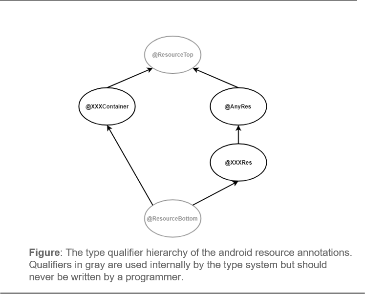

<div align="center">
  <a href="https://travis-ci.com/aagarwal1012/android-resource-checker">
    
  </a>
  <a href="https://codecov.io/gh/aagarwal1012/android-resource-checker">
    
  </a>
</div>

## Table of Contents

- [Overview](#overview)
- [Annotations](#annotations)
- [Prohibited Operations](#prohibited-operations)
- [Rationale](#rationale)
- [Setup](#setup)
- [Case Studies](#case-studies)
- [License](#license)

## Overview

The Android Resource Checker validates different kinds of resources in the program and guarantees that the user doesn’t incorrectly mix them within an expression. In addition, it prohibits meaningless operations, such as addition or multiplication of resource value. Since resources are passed in Android as integers, a code expecting a *string resource* of expected primitive type `int` can actually refer to a different type of resource and the compiler will accept it. For example, drawables can be passed as the expected primitive type of `int`, but it can actually reference a different type of resource, such as an `R.string` resource. Therefore, adding *@StringRes* annotation expresses that a resource parameter contains an `R.string` reference at compile-time, as shown below: 

```java
  public void setButtonText(@StringRes int id) {
    // set text on some button
  }

  // this will be flagged
  setButtonText(R.drawable.icon);
```

**Note:** In this chapter, **XXX** denotes the resource type present in Android, it includes *Animator*, *Anim*, *Any*, *Array*, *Attr*, *Bool*, *Color*, *Dimen*, *Drawable*, *Font*, *Fraction*, *Id*, *Integer*, *Interpolator*, *Layout*, *Menu*, *Navigation*, *Plurals*, *Raw*, *String*, *Styleable*, *Style*, *Transition*, and *Xml*.

## Annotations

The Android Resource Checker uses type annotations to indicate the resource type that the programmer intends an expression to have.

<p align="center">
	
</p>

The qualifiers in the android resource type system are as follows:

- ***@ResourceTop*** 

  indicates the top type of the android resource type system. This annotation is used internally, and should not be written by the programmer. This is the default annotation.

- ***@AnyRes*** 

  indicates that the annotated parameter can be any type of resource. It should be used when the specific type of resource is not known but it must be a resource type.

- ***@XXXRes*** 

  indicates the *XXX* resource type. For example, in order to declare a *Color* resource, a programmer can use *@ColorRes*.

- ***@XXXContainer*** 

  indicates the *XXX* inner class of Android resource class R. For example, in order to declare a String container, a programmer can use *@StringContainer*, then its member variables will be considered as *@StringRes* by default.

- ***@ResourceBottom*** 

  indicates that the value is null. It represents the bottom type in the android resource type system. This annotation is used internally, and should not be written by the programmer.

## Prohibited Operations

The Android Resource Checker prohibits the following uses of operators with *@XXXRes* and *@AnyRes*:

- Arithmetic operators include +, -, *, /, and % .
- Relational operators include >, <, >=, and <=.
- Bitwise operators include &, |, ^, ~, <<, >>, >>>, and <<<.
- Logical operators include &&, ||, and !.
- Assignment operators include +=, -=, *=, /= %=, <<=, >>=, &=, ^=, and |=.

Like every type-checker built with the Checker Framework, the Android Resource Checker ensures that the assignment and pseudo-assignments have consistent types. For example, it is not permitted to assign a *@StringRes* expression to a *@DrawableRes* variable or vice versa.

## Rationale

The Android Resource Checker prevents the mixing of different types of resources within the expressions. In Android, most of the resources are of type integer and some integer arrays present in `R.array` resource type, so there are a high number of chances that the programmer incorrectly pass one resource type to the other. Consider the following Java code :

```java
class AndroidResourceExample {
  @IdRes int a = R.id.a;
  @StringRes int b = R.string.b;
	
  int c = 10;
	
  void m() {
    a = R.string.res; // Error: assignment.type.incompatible, `a` cannot be assigned a StringRes 
    b = R.string.res; // OK: `b` is a StringRes
  }
	
  void m1() {
    c = a + b; // Warning: binary.operation.both.operand.found.resource
    a += R.id.res; // Warning: compound.assignment.both.found.resource
  }
	
  void m2() {
    a = getId(); // Ok: `a` is a IdRes
    setString(a); // Error: assignment.type.incompatible, `a` cannot be assigned a StringRes
  }
	
  void setString(@StringRes int res) {
    b = res; // Ok: `b` is a StringRes
  }
	
  @IdRes int getId() {
    return R.id.res;
  }
}
```

These examples show the potential error messages and warnings given by the checker when invalid assignments and operations are done on various resource types.

## Setup

This section explains how to configure your Android project to use the Android Resource Checker. 
Build the `androidresource-checker` by executing the command `./gradlew build`. After successfully building, there will be a jar containing the checker at `./build/libs/androidresource-checker.jar` and another jar containing the qualifier annotation classes at `./androidresource-checker-qual/build/libs/androidresource-checker-qual.jar`. 
After the above setup is done then proceed to the steps below. Make sure that all the changes should be made to the module’s *build.gradle* file, not the app’s *build.gradle* file.

1. In your module’s *build.gradle* file set the source and target compatibility to JavaVersion.VERSION_1_8

   ```groovy
   android {
       ...
       compileOptions {
           sourceCompatibility JavaVersion.VERSION_1_8
           targetCompatibility JavaVersion.VERSION_1_8
       }
   }
   ```

2. Add a build variant for running checkers.

   ```groovy
   android {
       ...
         buildTypes {
         ...
           checkTypes {
               javaCompileOptions.annotationProcessorOptions
	       .classNames.add("org.checkerframework.checker.androidresource.AndroidResourceChecker")
             // You can pass options like so:
             // javaCompileOptions.annotationProcessorOptions.arguments.put("warns", "")
           }
       }
   }
   ```

3. Declare the Checker Framework and Android Resource Checker dependencies:

   ```gro
   dependencies {
       ... existing dependencies...
       ext.checkerFrameworkVersion = '2.10.0'
       implementation files('<path to androidresource-checker-qual.jar>')
       annotationProcessor "org.checkerframework:checker:${checkerFrameworkVersion}"
       annotationProcessor files('<path to androidresource-checker.jar>'
   }
   ```

4. To run the checkers, build using the assemble*CheckTypes* variant.

   ```groovy
   ./gradlew assembleCheckTypes
   ```

## Case Studies

Given below are some case studies done on the various Android apps using Android Resource Checker:

- [**AnonyTweet**](https://github.com/aagarwal1012/AnonyTweet)**:**

  is a social networking Android app where anonymity is the priority. Posting, reacting, commenting can be done like confessions via this app. This app was made by me and it contains **6000+** lines of pure Java code.

  The original/unannotated source code of the library can be found in the [**master** ](https://github.com/aagarwal1012/AnonyTweet/)branch while the annotated code can be found in the [**androidresource-checker**](https://github.com/aagarwal1012/AnonyTweet/tree/androidresource-checker) branch and corresponding pull request can be seen via the [**link**](https://github.com/aagarwal1012/AnonyTweet/pull/3) so as to compare the changes.

- [**Calling Text**](https://github.com/mdg-iitr/calling_text)**:**

  is a smart calling assistant to enhance the calling experience of users. It helps you know the context of a call even before picking up. Finally, you can stop pondering why someone called you. It contains **20000+** lines of pure Java code.

  The original/unannotated source code of the app can be found in the [**master** ](https://github.com/aagarwal1012/calling_text)branch while the annotated code can be found in the [**androidresource-checker**](https://github.com/aagarwal1012/calling_text/tree/androidresource-checker) branch and corresponding pull request can be seen via the [**link**](https://github.com/aagarwal1012/calling_text/pull/1) so as to compare the changes.

There are more than **300+** annotations used in both of the case studies. I didn’t find any error or suppress any false positives in these case studies.
While adding annotations in the above case studies, I found that the current Android classes contain some functions which didn't contain Resource annotations, so I have to add them by myself as stub files, follow the link to get what are stub files: [creating a stub file](https://checkerframework.org/manual/#stub-creating). The following stub files are added in order to add annotations to the signatures, leaving the method bodies unchanged:

- `MenuItem` class contains the method named `getItemId()` which needs to be annotated.

  ```java
  package android.view;
  
  import org.checkerframework.checker.androidresource.qual.*;
  
  public interface MenuItem {
  
    @IdRes int getItemId();
  
  }
  ```

- `View` class contains the method named `getId()` which needs to be annotated.

  ```java
  package android.view;
  
  import org.checkerframework.checker.androidresource.qual.*;
  
  class View implements Drawable.Callback, KeyEvent.Callback,
         AccessibilityEventSource {
  
      @IdRes int getId();
  
  }
  ```

  

# License
Android Resource Checker is licensed under `MIT license`. View [license](https://github.com/aagarwal1012/android-resource-checker/blob/master/LICENSE).